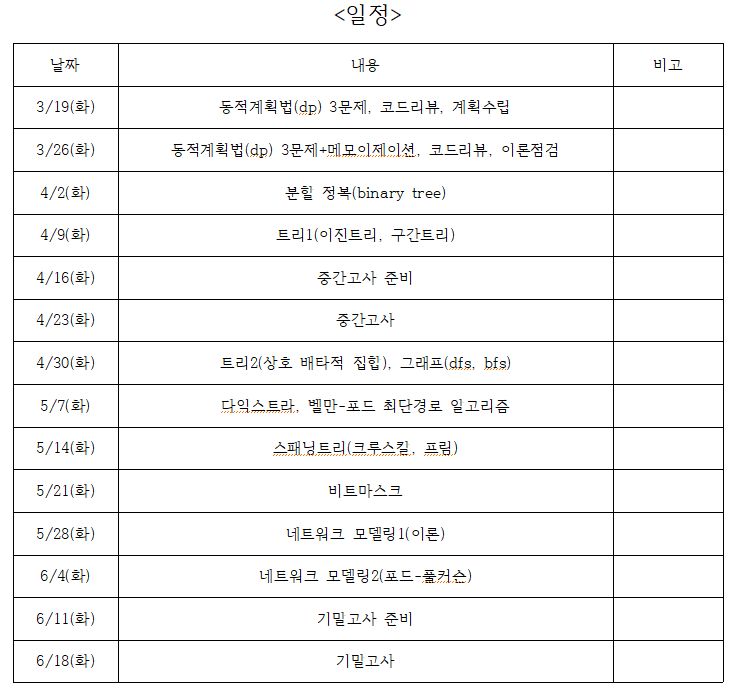

# ACM 대회 대비 알고리즘 스터디

## 인원
* 201511041 이동석
* 201511051 임상균
* 201511061 정창현

## 계획
   
   
## 문제 풀이

* 1주차 문제 (19.03.13~19.03.19)

> 2838 : [비숍 낙서](https://www.acmicpc.net/problem/2838)
> 2579 : [계단 오르기](https://www.acmicpc.net/problem/2579)
> 2098 : [외판원 순회](https://www.acmicpc.net/problem/2098)

* 2주차 문제 (19.03.19.~19.03.28)

> 1463 : [1로 만들기](https://www.acmicpc.net/problem/1463)
> 2193 : [이친수](https://www.acmicpc.net/problem/2193)
> 1005 : [ACM Craft](https://www.acmicpc.net/problem/1005)
> 11726 : [2Xn 타일링](https://www.acmicpc.net/problem/11726)

* 3주차 문제 (19.03.28.~19.04.02)

> 1992 : [쿼드트리](https://www.acmicpc.net/problem/1992)
> 2261 : [가장 가까운 두 점](https://www.acmicpc.net/problem/2261)
> 5620 : [가장 가까운 두 점의 거리](https://www.acmicpc.net/problem/5620)
> 2133 : [타일 채우기](https://www.acmicpc.net/problem/2133)

* 4주차 문제 (19.04.02.~19.04.09)

> 2740 : [행렬 곱셈](https://www.acmicpc.net/problem/2740)
> 2957 : [이진 탐색 트리](https://www.acmicpc.net/problem/2957)
> 5639 : [이진 검색 트리](https://www.acmicpc.net/problem/5639)
> 1991 : [트리 순회](https://www.acmicpc.net/problem/1991)
> 2250 : [트리의 높이와 너비](https://www.acmicpc.net/problem/2250)
> 3038 : [완전 이진 트리](https://www.acmicpc.net/problem/3038)
> 13325 : [이진 트리](https://www.acmicpc.net/problem/13325)
> - ( 3038, 13325는 시간 남으면 풀기 )