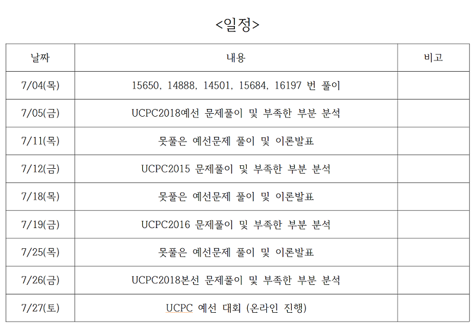

# ACM 대회 대비 알고리즘 스터디
​
## 인원
* 201511041 이동석
* 201511051 임상균
* 201511061 정창현
​
---------------------------------------------------

## 1학기 계획
   
   
## 문제 풀이
​
* 1주차 문제 (19.03.13~19.03.19)
​
> 2838 : [비숍 낙서](https://www.acmicpc.net/problem/2838)
> 2579 : [계단 오르기](https://www.acmicpc.net/problem/2579)
> 2098 : [외판원 순회](https://www.acmicpc.net/problem/2098)
​
* 2주차 문제 (19.03.19~19.03.28)
​
> 1463 : [1로 만들기](https://www.acmicpc.net/problem/1463)
> 2193 : [이친수](https://www.acmicpc.net/problem/2193)
> 1005 : [ACM Craft](https://www.acmicpc.net/problem/1005)
> 11726 : [2Xn 타일링](https://www.acmicpc.net/problem/11726)
​
* 3주차 문제 (19.03.28~19.04.02)
​
> 1992 : [쿼드트리](https://www.acmicpc.net/problem/1992)
> 2261 : [가장 가까운 두 점](https://www.acmicpc.net/problem/2261)
> 5620 : [가장 가까운 두 점의 거리](https://www.acmicpc.net/problem/5620)
> 2133 : [타일 채우기](https://www.acmicpc.net/problem/2133)
​
* 4주차 문제 (19.04.02~19.04.09)
​
> 2740 : [행렬 곱셈](https://www.acmicpc.net/problem/2740)
> 2957 : [이진 탐색 트리](https://www.acmicpc.net/problem/2957)
> 5639 : [이진 검색 트리](https://www.acmicpc.net/problem/5639)
> 1991 : [트리 순회](https://www.acmicpc.net/problem/1991)
> 2250 : [트리의 높이와 너비](https://www.acmicpc.net/problem/2250)
> 3038 : [완전 이진 트리](https://www.acmicpc.net/problem/3038)
> 13325 : [이진 트리](https://www.acmicpc.net/problem/13325)
> - ( 3038, 13325는 시간 남으면 풀기 )
​
* 5주차 문제 (19.05.01~19.05.07)
​
> 1260 : [DFS와 BFS](https://www.acmicpc.net/problem/1260)
> 4963 : [섬의 개수](https://www.acmicpc.net/problem/4963)
> 2178 : [미로 탐색](https://www.acmicpc.net/problem/2178)
> 2631 : [줄 세우기](https://www.acmicpc.net/problem/2631)
> 14502 : [연구소](https://www.acmicpc.net/problem/14502)
​
* 6주차 문제 (19.05.08~19.05.14)
​
> 1753 : [최단경로](https://www.acmicpc.net/problem/1753)
> 3640 : [제독](https://www.acmicpc.net/problem/3640)
> 4485 : [녹색 옷 입은 애가 젤다지?](https://www.acmicpc.net/problem/4485)
> 11657 : [타임머신](https://www.acmicpc.net/problem/11657)
​
* 7주차 문제 (19.05.15~19.05.21)

> flow chart 그리기!- 최단경로알고리즘 4개에 대해서 사용 되는 경우와 Big O 공부하기!!

> 2718 : [타일 채우기](https://www.acmicpc.net/problem/2718)

-----------------------------------------------------------

## 여름방학 계획
   
   
## 문제 풀이
​
* 1주차 문제 (19.06.24~19.07.04)
​
> 15650 : [N과 M (2)](https://www.acmicpc.net/problem/15650)
> 14888 : [연산자 끼워넣기](https://www.acmicpc.net/problem/14888)
> 14501 : [퇴사](https://www.acmicpc.net/problem/14501)
> 15684 : [사다리 조작](https://www.acmicpc.net/problem/15684)
> 16197 : [두 동전](https://www.acmicpc.net/problem/16197)

* UCPC 2018 예선 (19.07.05~19.07.11)
> [UCPC 2018 예선](https://www.acmicpc.net/category/detail/1891)
* UCPC 2016 (19.07.25)​
> [UCPC 2016](https://www.acmicpc.net/category/detail/1510)
* UCPC 2016 예선 (19.07.27)​
> [UCPC 2019 예선](https://www.acmicpc.net/category/detail/2053)

* 8월 1주차 문제 (19.08.02)
​
> 1916 : [최소비용 구하기](https://www.acmicpc.net/problem/1916)
> 1504 : [특정한 최단 경로](https://www.acmicpc.net/problem/1504)

* 8월 3주차 문제 (19.08.16)

> RMQ

1. <https://www.acmicpc.net/problem/2042> 

> Disjoint-Set

1. <https://www.acmicpc.net/problem/10775>
2. <https://www.acmicpc.net/problem/10774>

> 트라이

1. <https://www.acmicpc.net/problem/5052>
2. <https://www.acmicpc.net/problem/9934>

> 최소 스패닝 트리

1. <https://www.acmicpc.net/problem/1922>
2. <https://www.acmicpc.net/problem/1197>
3. <https://www.acmicpc.net/problem/9372>

> 네트워크 유량

1. <https://www.acmicpc.net/problem/2188>
2. <https://www.acmicpc.net/problem/1671>

### 9월 3주차 문제 (19.09.21 까지)
> [acm 문제](https://www.acmicpc.net/category/detail/1942)